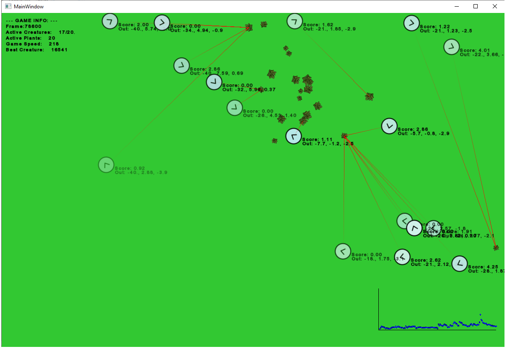

# Cpp-Evolution
Evolution Simulator made with C++, Sfml and Eigen. Uses Reinforcement learning to train Creatures to optain food.

## Program
Starting the Program opens a SFML Window which resembles a GameWorld in which creatures and food sources live. In the World, the creatures are governed by a neural network (NN), which is trained by an evolutionary process based on survival of the fittest and random mutations. 

The   Program can load existing Neural network structures from file, which where saved after a previous run of the Program or start with random initialisation of the NN.

In the beginning, creatures will behave randomly, after appro. 10 minutes of runtime the creates learned to collect food effectivley (i.e. with minimum time and without wasting of their stamina)



## Structure
The Project has two major classes; a Manager class and a Display class. The Display class `SMFL_Display` is responsible for the main loop at runtime, rendering all graphics and sounds and general SFML stuff. The manager class `Manager` manages all WorldObjects (Creatures, Food, ...) like spawning, killing, collision checks and so on. The methods get called by the display class in the main loop.

WorldObjects like creatures and food sources are seperate classes each, but all inherit from `WorldObject` class. 

Creatures contain a neural network, which is managed by the class `NeuralNetwork`. This class is responsible for input and output and learning.

In `main.cpp` is a very simple structure:

``` c++
// create the display class for window and main loop
SFML_Display Display(config::WINDOW_X, config::WINDOW_Y);

// create manager
Manager M;

// add food objects to the manager
M.addWorldObject<Food>(config::S_FOOD, M.food, Display.textureFood, Display.font);

// start the main loop, this will call all necessary manager funtions as well 
Display.StartMainLoop(M, P);
```

## Settings 
The settings are in the `config.hpp`.

```c++
struct config
{
	// window specific
	static const unsigned int FRAMERATE = 60;
	static const bool VSYNC = true;
	static const unsigned int WINDOW_X = 1200;
	static const unsigned int WINDOW_Y = 800;
	static const unsigned int TEXTSIZE = 12;

	static constexpr float foodSpriteScale = 0.3;
	static constexpr float creatureSpriteScale = 1.0;
	static constexpr float hunterSpriteScale = 0.7;
	static const int worldMargin = 20;

	// world object specific
	static constexpr float creatureDecayRate = 0.001;
	static constexpr float hunterDecayRate = 0.001;
	static constexpr float creatureFoodReach = 30;
	static const int REPRO_TIME_CREATURES = 12; // in seconds
	static const int REPRO_TIME_HUNTERS = 3; // in seconds
	static const int REPRO_TIME_FOOD = 1; // in seconds

	static const unsigned int S_CREATURES = 7;
	static const unsigned int MIN_CREATURES = 4;
	static const unsigned int MAX_CREATURES = 10;
	static const unsigned int S_FOOD = 4;
	static const unsigned int MAX_FOOD = 20;
	static const unsigned int S_HUNTERS = 2;

	static constexpr float MUTATION_FACTOR = 0.4;

	// loading and saving
	static const bool INIT_LOAD = false;
	static const std::string SAVE_PATH;
	static const std::string LOAD_ID_CREATURES;
	static const std::string LOAD_ID_HUNTERS;
	static const bool DO_SAVE = true;
	static const bool DO_PRINTLOG = true;
};
```

The Program can also be paused by pressing P and Simulation speed can be changes using the arrow keys.
